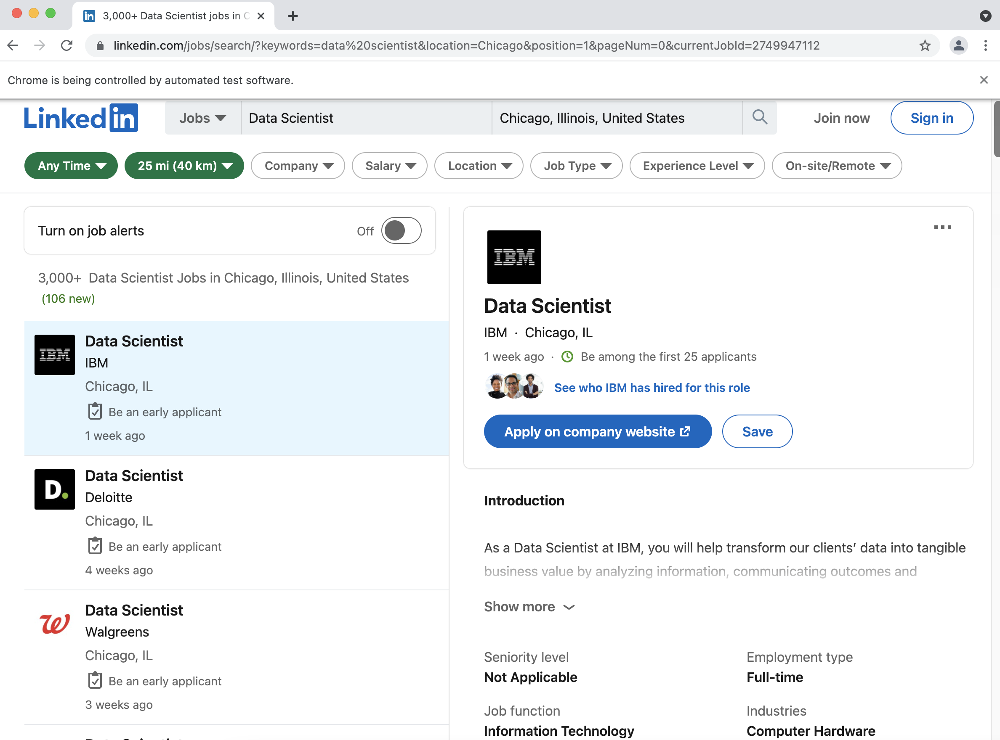

# Mini Project 1: The Rise of Data Science in the Job Market

Author: Jinfei Zhu

# Research Question

I become interested in this topic because in a university-wide social event, in the self-introduction part, it looks like everyone's study interests have something related to data analysis, computer science, statistics, and machine learning, Python, R, so on and so on. Of course, I am one of them. Besides this, if you google 'the sexist job in 2021', you will surprisingly (or unsurprisingly?) find that the answer of top 10 search engine results is the same: data scientist (I created a quick snapshot of the search result as a small archive).

So I begin to wonder, what's the time trend of the job of data scientist? Does more and more opportunities appear in the data science arear? Do the number of jobs available change evenly across the year, or is there any seasonal trend?  Will there be any annual trend too? For example, due to the pandemic, the job opportunity in 2020 could be less than usual, and 2008 - 2009 was greatly impacted by the Great Depression. Another possible question is When will these titles with new grad / summer intern comes out? 

# Construct my archive

To collect the data for new job openings, the first thing I can come up with is to scrape **LinkedIn**. LinkedIn has been trusted by both job seekers and companies, and has become a formal platform for people to connect. Many new jobs are posted every day and it has a filter to help us find out job positions within certain area and key words. To restrict my search result in a reasonable amount, I use the following url to limit my craper result.

`https://www.linkedin.com/jobs/search/?keywords=data%20scientist&location=Chicago&position=1&pageNum=0`

This url will provide us with the opennings of data scientists in Chicago. The scraping codes can be found at two notebooks in this repository: [1 Static Web Scraping with Requests](https://github.com/casp-a21/mp1-jinfei1125/blob/main/notebooks/1%20Static%20Web%20Scraping%20with%20Requests.ipynb), and [2 Dynamic Web Scraping with Selenium](https://github.com/casp-a21/mp1-jinfei1125/blob/main/notebooks/2%20Dynamic%20Web%20Scraping%20with%20Selenium.ipynb).

One problem I encountered in building my archive is that LinkedIn is a Dynamic Website, which means many important information doesn't appear directly in the HTML. So if I just make a simple requests and use BeautifulSoup to parse it, plenty of information is missed. To solve this, I have to use [selenium](https://www.selenium.dev/), which is a tool to automate browsers and it has a [python package](https://selenium-python.readthedocs.io/installation.html). I would also need [Chromedriver](https://chromedriver.chromium.org/home), which could open a window automatically and mimic human's browsing habits.

The archives I created are stored in the [archive](https://github.com/casp-a21/mp1-jinfei1125/tree/main/archive) folder in this github repository. `title_name` stores the company and title names on Oct 17, 2021 and `title_name_2.csv` stores the data on Oct 18, 2021.

# Archive Evaluation

## Is my data appropriate?

I believe my data is appropriate to investigate the job market trend and it's updating really quick. For example, on Oct 18, 2021, there are 113,397 data scientist jobs in the United States and 7,420 data scientist jobs in Chicago. Each day, countless new jobs are posted and it has been used by both huge global companies such as Apple and Microsoft, but also small local companies. So it provides a lot of useful information. Other data sources could be Indeed and Glassdoor, but I would think LinkedIn is the largest job-seeking platform in the US. Established in 2002, at Mountain View of California, LinkedIn has served job seekers and hiring managers for more than 20 years and has become the leader in the job market. Young as it may be, but old enough in the internet era, I believe it could serve as a palimpsest of the job market in a time perspective (Bailey, 2007).

Besides observing the long-time trend, my archive can also be used to catch the impact of a specific event, and therefore build event-based special collections (Rogers, 2019). 

## Temporal and Spatial Resolution

I would set my code to run daily, last for a year, so I could find out if the number of jobs available has seasonal changes and yearly changes. For example, the year 2020 is notoriously for job-seekers to land a job due to covid. To echo what we learn from Large Scale Computing, I could set a scheduled task in Elastic Container Service to run the web scraping codes. Because the web is dynamic, there is no traditional depth or layer here since what we need is to mimic the clicking and scrolling down actions of a human. But I would say it's two-layer: the first layer for searching results (company names and position names), the second layer for detailed job descriptions. (Brugger, 2018)

The current archive is not big if I only scrape the titles and company names each day for the data scientist job in Chicago. So it's not very big data. However, if I include the job description data (which will be longer) and not limit my job only in Chicago and data scientist, it could be much bigger and can provide more insight into the trend in the job market. I can also conduct topic modeling in the job description. (Graham et al.)

## Transformation of digitality

The job information data on LinkedIn is born-digital. It is material that has never existed in any form other than digital since companies post their jobs solely online. Nowadays, most jobs are only posted online and there is no other format for these job openings. After scraping, they have been stored in my local machine as CSV files and their digitality has become reborn digitality. Reborn digital material is born-digital material that has been collected and preserved, and that has been changed in this process to such an extent that it is not identical to the born-digital material from which it was made (Brugger, 2018). 

## Can this scraper last a long time?

The website is making constantly changes. For example, `job-result-card__location` has been changed to `job-search-card__location` from March to October, and these kinds of small changes are hard to catch. Gradually, my code could breakdown when LinkedIn update their website and I would need to make constant adjustments to my code (Brugger, 2018). 

## Ethical Concerns

While job descriptions are public data and can be accessed by everyone using the internet, do companies really want the public to keep these data? While job-seekers post their names, job experience, and education background online, as well as personal summaries, or even their resume and personal contact information, which increases ethical concerns. I think in my case when my targets are companies' names and job titles, the scraping tasks are not relevant to human, so it may be fine. However, if I decide to include users' profile data, including their images, summaries, and experience, this could invade their privacy and lead to ethical concerns. (Lomborg, 2019)

Besides, LinkedIn has a `robots.txt` file that disallows all users to scrape its website, although we can apply to be added to its whitelist. In fact, many companies including `glassdoor`, `indeed`, and even `amazon` (when we discussed our scraping strategy in class, I didn't expect amazon disallows developers to scrape their listed products) have a `robots.txt` file to avoid scraping activities. 

# Reference

- Bailey 2007 "Time Perspectives, palimpsests and the archaeology of time"

- Brugger 2018 The Archived Web

- Rogers 2019 "Periodizing Web Archiving: Biographical, Event-Based, National and Autobiographical Traditions"

- Graham et al. 2015 The Joys of Big Data for Historians

- Lomborg 2019 "Ethical Considerations for Web Archives and Web History Research"

- [Scrape Linkedin Guide](https://maoviola.medium.com/a-complete-guide-to-web-scraping-linkedin-job-postings-ad290fcaa97f)

- [Debug ChromeDriver](https://stackoverflow.com/questions/60362018/macos-catalinav-10-15-3-error-chromedriver-cannot-be-opened-because-the-de)

- [ChromeDriver Setup](https://zwbetz.com/download-chromedriver-binary-and-add-to-your-path-for-automated-functional-testing/)

- [Set PATH variable](https://www.cyberciti.biz/faq/appleosx-bash-unix-change-set-path-environment-variable/) and [another tutorial](https://www.kenst.com/2015/03/including-the-chromedriver-location-in-macos-system-path/) and [a helpful debug video](https://www.youtube.com/watch?v=7R5n0sNSza8&ab_channel=StudentEngineer)

- [CSS Selector](https://developer.mozilla.org/en-US/docs/Learn/CSS/Building_blocks/Selectors)

- [Job Market Trend Analysis](https://medium.com/henry-jia/job-market-trend-analysis-d6b290b71e41)

- [selenium documentation](https://www.selenium.dev/documentation/webdriver)

- [An Introduction to robots.txt](https://www.linkedin.com/learning/advanced-seo-developing-an-seo-friendly-website/robots-txt?autoAdvance=true&autoSkip=false&autoplay=true&resume=true&u=57690273) and LinkedIn's [robots.txt](https://www.linkedin.com/robots.txt) and [Prohibited Software and Extensions](https://www.linkedin.com/help/linkedin/answer/56347/prohibited-software-and-extensions?lang=en)

- [A Complete Guide to Web Scraping LinkedIn Job Postings](https://maoviola.medium.com/a-complete-guide-to-web-scraping-linkedin-job-postings-ad290fcaa97f)

- [BeautifulSoup Documentations](https://www.crummy.com/software/BeautifulSoup/bs4/doc/#find-all)

- [scraping glassdoor](https://towardsdatascience.com/selenium-tutorial-scraping-glassdoor-com-in-10-minutes-3d0915c6d905)

- [linedin scrapper](https://github.com/joeyism/linkedin_scraper)

- Course Slides and Codes

